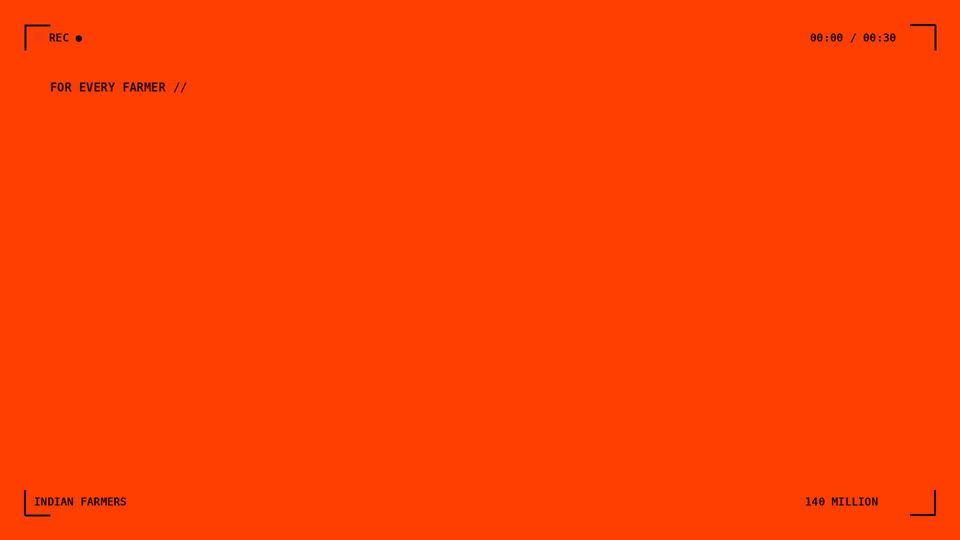

# AgroPulse — Edge Crop Diagnostics & Microclimate Risk Engine
> **Team 15 — Team Acers** | Intelligent Agricultural Decision-Support System

[](https://github.com/Argonyx-26/T15-Team-Acers)
[](LICENSE)
[](agropulse-web/)
[](agropulse-app/risk-engine/)
[](https://huggingface.co/)

---

## 🌾 Overview

**AgroPulse** is a privacy-first, offline-capable agronomic intelligence platform designed for smallholder farmers across South and North India (**Karnataka, Kerala, Tamil Nadu, and Punjab**). 

It fuses **edge optical leaf pathology**, **hyper-local 24-hour microclimate disease risk modeling**, **interactive knapsack dosage math**, and **dual-engine conversational AI** (instant verified domain rules + local browser-based LLM) to deliver actionable crop advisories without recurring cloud API fees or unreliable rural connectivity bottlenecks.

---

## 🎬 Product Pitch & Walkthrough

<p align="center">
  
</p>

> 📹 **High-Definition Video**: [`brag/agropulse_kinetic_169_widescreen.mp4`](brag/agropulse_kinetic_169_widescreen.mp4) (1080p 16:9 Widescreen with synced bass audio)

---

## 🚀 System Status & Completed Deliverables

| Module / Component | Status | Implementation Details |
| --- | :---: | --- |
| **Leaf Vision Capture** | ✅ **Completed** | Full camera lifecycle with front/rear flip toggle, instant stream binding, file drag-and-drop, and 17 preset test vectors |
| **Neural Vision Classifier** | ✅ **Completed** | Dual-tier inference: FastAPI Python backend (TFLite) + client-side in-browser WebWorker (`onnx-community/mobilenet_v2_1.0_224-plant-disease-identification-ONNX`) |
| **BUG-01 Guard** | ✅ **Completed** | Strict non-leaf clutter rejection (`Background_without_leaves`) to prevent false-positive spray triggers on desks/tools |
| **Microclimate Risk Engine** | ✅ **Completed** | 24-hour Open-Meteo & OpenWeather historical stream, Wallin/IRRI sporulation risk scoring, and spray drift safety index |
| **Field Location & Map** | ✅ **Completed** | Direct Google Maps roadmap tiles (bypasses Firefox/Brave frame restrictions), custom glowing pin, GPS locator, and 30+ regional district profiles |
| **Conversational AI Companion** | ✅ **Completed** | Dual-Engine: instant agronomic rule engine + streaming client-side LLM ([`HuggingFaceTB/SmolLM2-360M-Instruct`](https://huggingface.co/HuggingFaceTB/SmolLM2-360M-Instruct)) via WebGPU/WASM |
| **16L Knapsack Dosage Math** | ✅ **Completed** | Exact tank dilution calculations, water volume requirements, chemical formulations, and certified organic biocontrols |
| **Multilingual Voice Advisories** | ✅ **Completed** | Synthesized Kannada, Hindi, and English audio playback scripts for field accessibility |
| **Packaging & Launchers** | ✅ **Completed** | Unified launcher script (`./run-all.sh`), modular website runner (`./run-website.sh`), and backend server (`./run-backend.sh`) |

---

## 🧠 AI & Model Architecture

```
               ┌────────────────────────────────────────────────────────┐
               │              Farmer Leaf Photo / Webcam Capture         │
               └───────────────────────────┬────────────────────────────┘
                                           │
                    ┌──────────────────────┴──────────────────────┐
                    ▼                                             ▼
        [1. FastAPI Neural Backend]                  [2. Browser Vision AI Fallback]
          Uvicorn :8000 / TFLite                       MobileNetV2 ONNX via WASM
       (17-Class Crop Pathology Model)            (onnx-community PlantVillage ONNX)
                    │                                             │
                    └──────────────────────┬──────────────────────┘
                                           ▼
                           [Autonomous Disease Verification]
                       (Rice, Banana, Sugarcane, Coconut, etc.)
                                           │
        ┌──────────────────────────────────┴──────────────────────────────────┐
        ▼                                                                     ▼
[Live Weather & Field Location]                                 [AgroPulse AI Companion]
- Direct Google Maps Canvas                                     - Instant Verified Domain Expert
- 24h Microclimate Risk Curve                                   - In-Browser SmolLM2 (360M ONNX)
- Wind Spray Drift Indicator                                    - 16L Knapsack Dilution Calculator
- Regional Soil Intelligence                                    - Kannada / Hindi Audio Playback
```

### Models Used:
1. **Edge LLM (Chat Companion)**: [`HuggingFaceTB/SmolLM2-360M-Instruct`](https://huggingface.co/HuggingFaceTB/SmolLM2-360M-Instruct)
   * Format: ONNX 4-bit quantized (`q4`), ~180 MB.
   * Execution: Runs 100% in-browser via WebGPU or WASM with zero server dependency.
2. **Vision AI (Leaf Pathology)**: [`onnx-community/mobilenet_v2_1.0_224-plant-disease-identification-ONNX`](https://huggingface.co/onnx-community/mobilenet_v2_1.0_224-plant-disease-identification-ONNX)
   * Format: MobileNetV2 ONNX `q4`, ~3 MB.
   * Execution: Browser WebWorker background thread.
3. **Primary Backend Model**: Custom trained MobileNetV2 exported to TensorFlow Lite (`agropulse_leaf_classifier.tflite`, 2.5 MB) with 86.1% validation accuracy over 17 crop categories.

---

## ⚡ Quickstart

### Prerequisites
* **Node.js**: >= 18.0.0
* **Python**: >= 3.10
* **Bash**: Linux / macOS / WSL

### 1. Launch All Services with One Command
The repository includes an automated launcher that starts the neural backend and the web application concurrently:

```bash
chmod +x run-all.sh
./run-all.sh
```

* **Web Application**: [http://localhost:5173](http://localhost:5173)
* **FastAPI Backend**: [http://localhost:8000](http://localhost:8000) (Interactive Swagger docs: `/docs`)

---

### 2. Individual Service Launchers

#### Run Web Interface Only:
```bash
chmod +x run-website.sh
./run-website.sh
```

#### Run FastAPI Neural Backend Only:
```bash
chmod +x run-backend.sh
./run-backend.sh
```

#### Run Automated Test Vector Validation:
Runs a stress test across all 17 plant classes and prints accuracy metrics:
```bash
chmod +x trial-run.sh
./trial-run.sh
```

---

## 📂 Project Structure

```
├── agropulse-web/               # Production React 18 + Vite Web Application
│   ├── src/
│   │   ├── components/          # UI Components (LeafCameraCapture, LiveWeatherAndLocation, etc.)
│   │   ├── data/                # Crop advisories, regional districts, soil profiles
│   │   ├── hooks/               # useVisionClassifier, useLLMChat
│   │   ├── services/            # dosageCalculator, riskService, farmerChatService
│   │   └── workers/             # vision.worker.ts, llm.worker.ts (WASM/WebGPU threads)
│   ├── index.html
│   └── package.json
├── agropulse-app/               # React Native & Expo Mobile Application
│   ├── risk-engine/             # Python FastAPI Neural Engine & Training Pipeline
│   │   ├── artifacts/           # TFLite models, label mappings, training metrics
│   │   ├── server.py            # FastAPI inference and health endpoints
│   │   ├── train_model.py       # Transfer learning training pipeline
│   │   └── smart_inference.py   # Hierarchical crop and disease inferrer
│   └── assets/                  # Mobile icons and assets
├── data/                        # Agricultural package-of-practices & regulatory records
│   ├── advisories.csv           # Validated disease treatment registry
│   ├── target-districts.csv     # District baseline coordinates and climate zones
│   └── diagnostic-protocols.csv # Field symptom triage protocols
├── run-all.sh                   # Unified background launcher
├── run-website.sh               # Vite development server script
├── run-backend.sh               # FastAPI uvicorn server script
└── trial-run.sh                 # TFLite test vector validation script
```

---

## 🛡️ Agricultural Safety Protocols

1. **Strict Active-Ingredient Verification**: No pesticide dosage is suggested without an approved CIBRC/State Agricultural University label recommendation.
2. **Knapsack Sprayer Safety (16L)**: All dilutions are calculated strictly per 16-liter knapsack tank to avoid fatal over-concentrations on small farms.
3. **Pre-Harvest Intervals (PHI)**: Enforced waiting periods are displayed prominently to ensure food safety and consumer health.
4. **Organic Biocontrol First**: Where available, bio-fungicides (*Trichoderma viride*, *Pseudomonas fluorescens*, Neem oil) are prioritized alongside cultural drainage/pruning practices.

---

## 👥 Team Acers (T15)
* Built for the 2026 Agricultural Edge AI Challenge.
